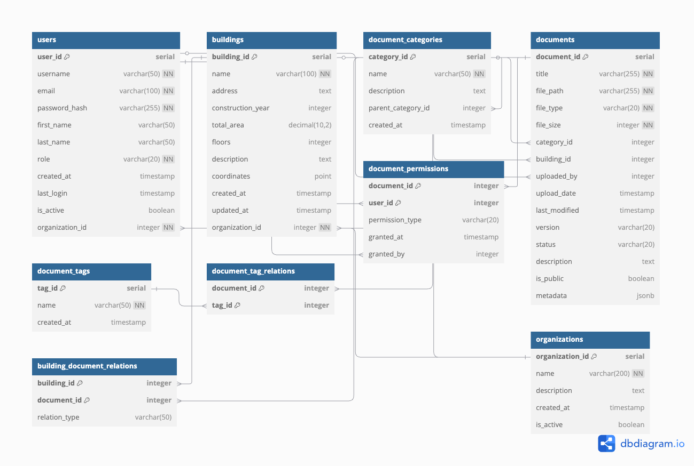

# BUILD.ING Document Management System Database

This directory contains the database schema and documentation for the BUILD.ING Document Management System.

## Database Schema

The database is designed using PostgreSQL and includes the following core tables:

- **Users**: Stores user information and authentication details
- **Buildings**: Contains information about buildings in the system
- **Document Categories**: Hierarchical categories for document organization
- **Documents**: The main table storing document metadata and references to files
- **Document Tags**: Tagging system for documents
- **Document Versions**: Version history for documents
- **Document Permissions**: Access control for documents

## Entity Relationship Diagram

The database schema is visualized in the diagram below:



You can also visualize and edit this diagram using the provided `database_diagram.dbml` file at [dbdiagram.io](https://dbdiagram.io/).

## Schema Implementation

To implement this schema in a PostgreSQL database:

```bash
# Connect to PostgreSQL
psql -U your_username -d your_database_name

# Or create a new database first
createdb building_docs_db
psql -U your_username -d building_docs_db

# Run the schema file
psql -U your_username -d building_docs_db -f schema.sql
```

## Schema Design Decisions

1. **Document Versioning**: Documents have a separate `document_versions` table to track all changes and versions.
2. **Hierarchical Categories**: The `document_categories` table has a self-reference to allow for nested categories.
3. **Many-to-Many Relationships**: Junction tables are used for document tags, permissions, and building relationships.
4. **Metadata Flexibility**: The `documents` table includes a JSONB column for flexible metadata storage.
5. **Automatic Timestamps**: Triggers automatically update the `last_modified` timestamp when records are updated.

## Modifying the Schema

When making changes to the database schema:

1. Update the `schema.sql` file with your changes
2. Update the `database_diagram.dbml` file to keep the documentation in sync
3. Document any significant changes in this README

## Free Database Diagram Tools

The schema can be visualized and modified using these free tools:

- [dbdiagram.io](https://dbdiagram.io/) - Recommended, uses DBML syntax
- [Lucidchart](https://www.lucidchart.com/) - Free tier available
- [DrawSQL](https://drawsql.app/) - Specialized for SQL databases
- [ERDPlus](https://erdplus.com/) - Free ER diagram tool
- [QuickDBD](https://www.quickdatabasediagrams.com/) - Simple and intuitive
